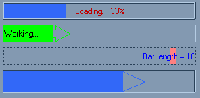



## ProgressBar Replacement

### Description

As most of you know the progressbar that comes with windows is in a HUGE file, and isn't even that great, so I've attempted to make a replacement for it. I've seen a few other attempts at this, but they can't do some of the stuff my progressbar can, and my progressbar is less than 50 kb!! The screenshot shows some of what it can do, and a demo program is included. If you like it, VOTE!!!!!
 
### More Info
 

             |
---                |---
**Submitted On**   |2001-03-18 21:32:04
**By**             |[Daniel Taylor](https://github.com/Planet-Source-Code/PSCIndex/blob/master/ByAuthor/daniel-taylor.md)
**Level**          |Intermediate
**User Rating**    |3.8 (19 globes from 5 users)
**Compatibility**  |VB 4\.0 \(32\-bit\), VB 5\.0, VB 6\.0
**Category**       |[Custom Controls/ Forms/  Menus](https://github.com/Planet-Source-Code/PSCIndex/blob/master/ByCategory/custom-controls-forms-menus__1-4.md)
**World**          |[Visual Basic](https://github.com/Planet-Source-Code/PSCIndex/blob/master/ByWorld/visual-basic.md)
**Archive File**   |[CODE\_UPLOAD172493182001\.zip](https://github.com/Planet-Source-Code/daniel-taylor-progressbar-replacement__1-21756/archive/master.zip)

